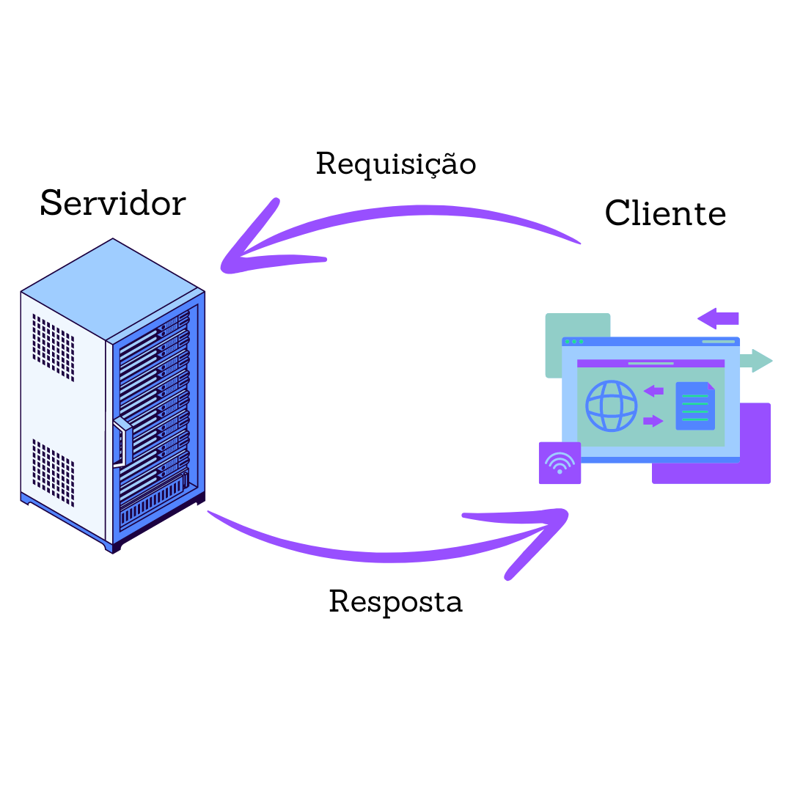
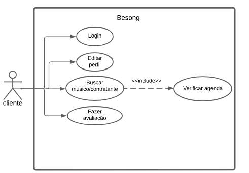
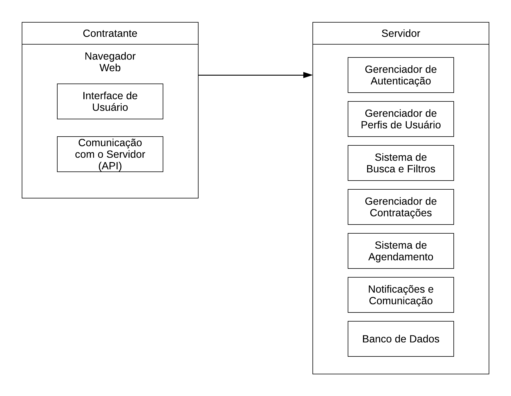
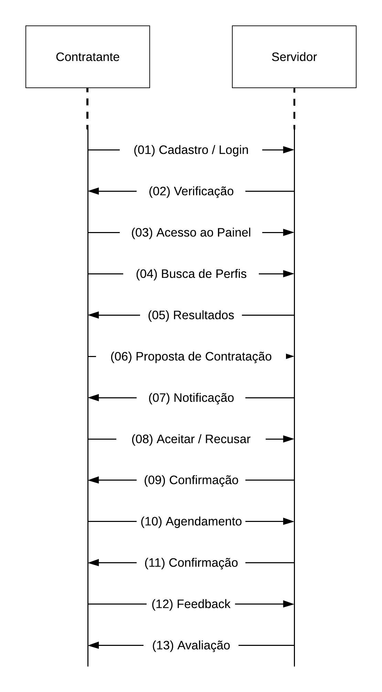
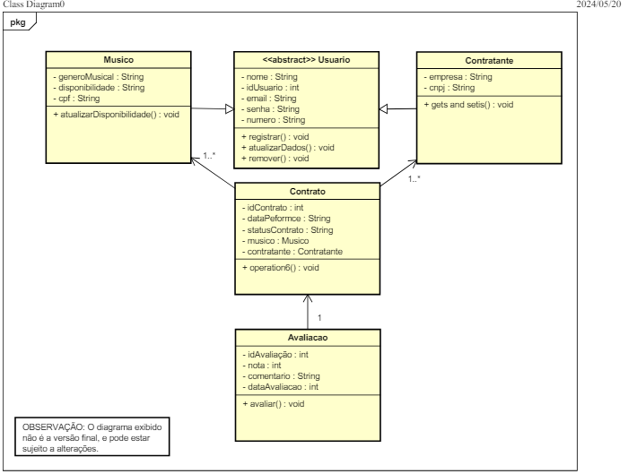
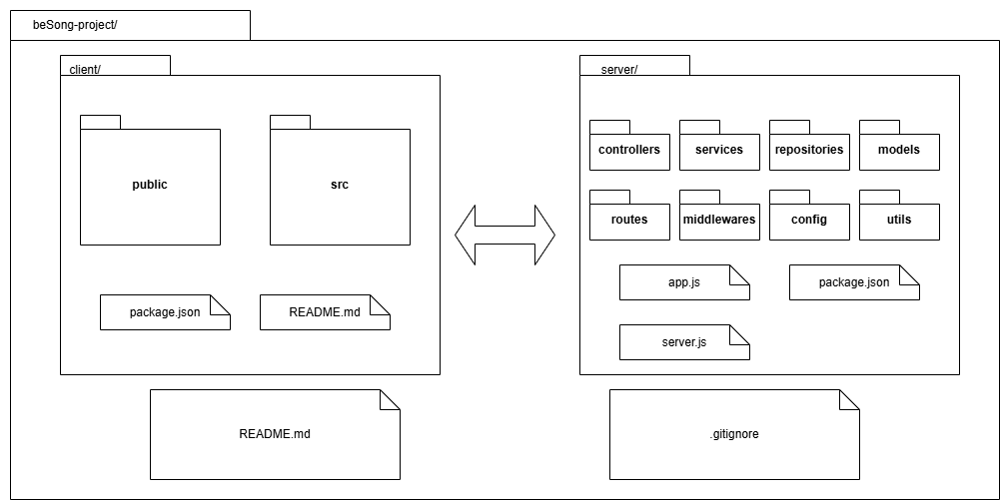

## **1 Introdução** 

### **1.1 Propósito** 

Este documento descreve a arquitetura do sistema sendo desenvolvido pelo grupo Orion, na disciplina de MDS – Métodos de Desenvolvimento de Software – edição do primeiro semestre de 2024, BeSong,  a fim de fornecer uma visão abrangente do sistema para desenvolvedores, testadores e demais interessados. 

### **1.2 Escopo** 

O detalhamento do escopo se encontra no documento de visão do produto e do projeto. Porém, em linhas gerais o escopo do produto compreende em uma aplicação web com o objetivo de conectar com eficiência e transparência músicos e contratantes, assim facilitando a descoberta, contratação e agendamento de performances/shows ao vivo, resolvendo o problema de desconexão entre músicos, artistas e pessoas que queiram contratar seus serviços. 

## **2 Representação Arquitetural** 

### **2.1 Definições** 

O sistema seguirá uma arquitetura de cliente-servidor. 

### **2.2 Justificativa**

A escolha do padrão de arquitetura cliente-servidor se deve por alguns fatores que se alinham com os requisitos do projeto, a experiência da equipe e objetivo final. A arquitetura cliente-servidor oferece uma abordagem simples de entender e implementar, sendo um dos motivos para a escolha, levando em consideração os conhecimentos da equipe e a busca por conhecer uma nova arquitetura. Com a arquitetura também pode concentrar-se mais na entrega de valor para o usuário final do que em aspectos técnicos complexos, ela permite uma divisão clara de responsabilidades entre o Front-End e o Back-End, facilitando o gerenciamento da complexidade do sistema. A separação de responsabilidades entre cliente e servidor facilita a manutenção e evolução do sistema ao longo do tempo, onde alterações no Front-End não devem impactar no Back-End e vice-versa, o que deixa mais fácil fazer atualizações ou adicionar novos recursos. 

### **2.3 Detalhamento** 

O Modelo Arquitetural de Cliente-Servidor, como já citado anteriormente, faz decomposição de tarefas entre os servidores, que são aqueles que provêm um recurso ou serviço, e os clientes, que são aqueles que solicitam os serviços. Um fator importante é que essa arquitetura é utilizada em aplicações web que é o caso do projeto BeSong aqui apresentado. 

Aprofundando um pouco mais no modelo arquitetural é interessante frisar que os clientes têm como função a interação com o usuário, enviando requisições ao servidor e apresentando os dados recebidos, muitas vezes representados pelo sistema Front-End. Em relação ao servidor, sua função é processar as requisições dos clientes e gerenciar os recursos como arquivos, banco de dados além do envio de respostas aos clientes, muitas vezes representado pelo sistema Back-End (TANENBAUM; WETHERALL, 2011). 

A comunicação realizada pelo modelo arquitetural Cliente-servidor pode implementar protocolos HTTP/HTTPS que é o caso do BeSong. Essa conexão pode ser síncrona ou assíncrona, onde o cliente pode continuar outras tarefas enquanto aguarda a resposta esperada. (SILBERSCHATZ; GALVIN; GAGNE, 2016). 

As principais características do modelo citado incluem: 

Divisão de tarefas entre Front e Back; 

Escalabilidade; 

Horizontalmente pela adição de servidores; 

Verticalmente a partir do aumento de recursos de hardware do servidor; 

Flexibilidade – Diferentes clientes podem interagir a partir do mesmo servidor; 

Segurança - Controles de acesso, autenticação e criptografia centralizados no servidor (KROENKE; AUER, 2017). 

    
<b>Figura 01:</b>Arquitetura Cliente-Servidor

    
<b>Fonte:</b>Autoria própria

### **2.4 Metas e restrições arquiteturais** 

O Sistema deve ser capaz de lidar com um grande número de usuários simultâneos; 

Suportar o crescimento do volume de dados e requisições; 

Proteção dos dados a partir das transições utilizando protocolo HTTPS; 

Interface intuitiva e responsiva para o uso em qualquer plataforma; 

Realizar testes de usabilidade e o feedback do usuário; 

Manutenção facilitada a partir de uma arquitetura modular; 

Orçamento para infraestrutura é baixo e por esse motivo deve ser utilizado tecnologia Open-Source; 

Compatibilidade tecnológica é importante para que seja de fácil integração o back-end e Front-End; 

Conformidade com a LGPD; 

A infraestrutura deve ser limitada ao custo e a disponibilidade do hardware; 

### **2.5 Visão de Casos de uso (escopo do produto)** 

O projeto Besong visa de forma eficiente e transparente resolver o problema de desconexão entre músicos e contratantes, oferecendo um espaço onde ambas as partes possam se encontrar e interagir de forma confiável e simples. A arquitetura servidor-cliente deste produto permite centralizar o gerenciamento de dados e recursos, oferecendo uma experiência de usuário consistente, segura e escalável, promovendo um ambiente onde performances ao vivo podem ser facilmente descobertas, contratadas e agendadas. 

    
<b>Figura 02:</b>Caso de Uso

    
<b>Fonte:</b>Autoria própria

### **2.6 Visão lógica**

    
<b>Figura 03:</b>Visão logica do produto

    
<b>Fonte:</b>Autoria própria

Descrição dos Componentes: 

**Client** 

Navegador Web: Interface usada pelos usuários (músicos e contratantes) para interagir com a plataforma. 

Interface de Usuário (Front-End): Exibe informações e recebe entradas dos usuários. Inclui telas de login, cadastro, busca de músicos, gerenciamento de perfil, e agendamento. 

Comunicação com o Servidor (API): Módulo responsável por enviar e receber dados do servidor utilizando APIs RESTful. 

**Server**

Gerenciador de Autenticação: Lida com login, logout e gerenciamento de sessões. Verifica credenciais e autentica usuários. 

Gerenciador de Perfis de Usuário: Permite aos usuários criar e editar seus perfis, incluindo informações pessoais, portfólio e preferências. 

Sistema de Busca e Filtros: Implementa a lógica de busca para que contratantes encontrem músicos baseados em critérios como gênero musical, localização, disponibilidade etc. 

Gerenciador de Contratações: Lida com a criação e o gerenciamento de propostas de contratação entre contratantes e músicos, incluindo negociações e aceitação de ofertas. 

Sistema de Agendamento: Gerencia a agenda de performances, permitindo que músicos e contratantes vejam disponibilidade e confirmem datas. 

Notificações e Comunicação: Envia notificações (e.g., e-mails, SMS) para atualizar usuários sobre status de contratações, eventos próximos, e outras comunicações importantes. 

Sistema de Pagamentos (API): Processa transações financeiras, garantindo pagamentos seguros entre contratantes e músicos. 

Banco de Dados: Armazena todas as informações da plataforma, incluindo perfis de usuários, detalhes de contratações, agendas, e transações financeiras. 

    
<b>Figura 04:</b>Diagrama de Fluxo do Usuário

    
<b>Fonte:</b>Autoria própria

Fluxo de Usuário: 

1. Cadastro/Login: Músicos e contratantes se cadastrar ou fazer login na plataforma. 

2. Verificação: O servidor verifica as credenciais e autentica o usuário. 

3. Acesso ao Painel: O usuário autenticado acessa seu painel personalizado. 

4. Busca de Perfis: Contratantes buscam músicos e músicos buscam oportunidades. 

5. Resultados: O servidor retorna os resultados da busca com perfis ou oportunidades. 

6. Proposta de Contratação: Contratantes enviam propostas para músicos através da plataforma. 

7. Notificação: Músicos são notificados sobre novas propostas. 

8. Aceitar/Recusar: Músicos aceitam ou recusam propostas de contratação. 

9. Confirmação: O servidor confirma a aceitação ou recusa da proposta. 

10. Agendamento: Detalhes da apresentação são agendados e confirmados. 

11. Confirmação: O servidor confirma os detalhes do agendamento. 

12. Feedback: Após a apresentação, contratantes e músicos deixam feedback. 

13. Avaliação: O servidor atualiza as avaliações nos perfis de ambos. 

    
<b>Figura 05:</b>Diagrama de Classes

    
<b>Fonte:</b>Autoria própria

O diagrama de classes conta com cinco classes, sendo elas as classes: 

**Usuário:** que é a classe base para músicos e contratantes. 

**Músico:** que possui herança em usuário, e além disso possui atributos específicos como a disponibilidade e também seu gênero musical. 

**Contratante:** Subclasse de Usuário que representa contratantes, incluindo informações como empresa e CNPJ. 

**Contrato:** Classe que gerencia os detalhes de um contrato de performance, incluindo datas e status. 

**Avaliação:** Classe que gerencia as avaliações feitas pelos contratantes sobre as performances dos músicos. 

### **2.7 Visão de implementação**  

A arquitetura cliente-servidor é uma abordagem fundamental para o desenvolvimento de sistemas distribuídos e aplicações web. Nesta arquitetura, a separação de responsabilidades é clara: o cliente lida com a interação do usuário e a apresentação, enquanto o servidor gerencia a lógica de negócios, o acesso a dados e as funções de Back-End. 

Esta visão de implementação destaca a modularidade e a escalabilidade da arquitetura cliente-servidor, permitindo que equipes de desenvolvimento trabalhem de forma independente em diferentes partes do sistema, ao mesmo tempo em que mantêm uma integração coesa. 

    
<b>Figura 06:</b>Diagrama de Pacotes

    
<b>Fonte:</b>Autoria própria

Camada de Apresentação (client/): 

**public/:** Contém todos os ativos estáticos como HTML, CSS e imagens que são servidos diretamente ao navegador. Esta é a interface com os usuários. 

**src/:** Inclui os scripts e componentes da aplicação que são compilados e empacotados para execução no lado do cliente. 

**package.json:** Gerencia as dependências e scripts de construção do projeto do lado do cliente. 

**README.md:** Fornece instruções e documentação sobre a aplicação cliente. 

Lógica de Negócios e Regras de Negócios (server/): 

**controllers/:** Define os controladores que gerenciam as solicitações recebidas pelos clientes. 

**services/:** Contém a lógica de negócios e a interação com os repositórios de dados. 

**middlewares/:** Implementa funções intermediárias para processamento de requisições e respostas. 

Comunicação com o Banco de Dados (server/): 

**repositories/:** Abstrai a lógica de acesso aos dados subjacentes. 

**models/:** Representa as entidades de negócios e a estrutura de dados. 

**config/:** Armazena configurações do aplicativo e inicialização do servidor. 

**utils/:** Fornece utilitários e funções auxiliares para uso em todo o servidor. 

**app.js e server.js:** Inicializam e configuram o servidor e a aplicação, respectivamente. 

**.gitignore:** Especifica os arquivos e diretórios ignorados pelo Git. 

**package.json:** Gerencia as dependências e scripts de construção do projeto do lado do servidor. 

OBS: O diagrama e os arquivos podem sofrer alterações ao longo do projeto. 

### **2.8 Visão de Implantação**

Para a implementação do BeSong, serão utilizadas as seguintes tecnologias: HTML, CSS e JavaScript: para a criação, estilização e interatividade da interface do usuário, Node.js: utilizado no Back-End para permitir que os desenvolvedores possam usar JavaScript de forma eficiente, proporcionando um ambiente de execução rápido e escalável, MySQL: sistema de gerenciamento de banco de dados.

A infraestrutura de hardware para a aplicação será projetada para garantir desempenho, escalabilidade e confiabilidade. A aplicação será hospedada em servidores Node.js, escolhidos por sua capacidade de lidar com operações de E/S assíncronas e escalabilidade eficiente, tornando-o ideal para aplicações web de alta performance. Outra escolha foi a AWS, que é uma das principais plataformas de nuvem do mercado, oferecendo uma infraestrutura robusta, segura e escalável. Seus serviços integrados permitem fácil implantação, monitoramento e manutenção das aplicações.

O banco de dados MySQL será implementado para gerenciar os dados do projeto. Ele foi escolhido devido a escalabilidade: capacidade de lidar com um grande volume de dados e múltiplas transações simultâneas, segurança: funcionalidades avançadas de segurança para proteção dos dados dos usuários, confiabilidade: alta disponibilidade e suporte a recuperação de dados em caso de falhas, integração: facilidade de integração com o Node.js, permitindo uma comunicação eficiente entre o Back-End e o banco de dados.

### **2.9 Restrições Adicionais**

O sistema deve ser intuitivo e fácil de usar, com uma interface acessível para todos os usuários, pois a usabilidade melhora a satisfação do usuário e permite que os usuários realizem o acesso ao sistema de forma fácil e rápida; 

O software deve ser compatível com múltiplas plataformas, como diferentes navegadores e sistemas operacionais. Essa portabilidade permite que os usuários acessem o sistema em diversos ambientes, aumentando a flexibilidade e o alcance; 

O sistema deve ser de projetado de forma modular, facilitando correção de bugs e adição de novas funcionalidades, pois a manutenibilidade reduz os custos e o tempo de manutenção, permitindo uma evolução contínua em reposta às necessidades dos usuários; 

O tempo de resposta para operações críticas não deve exceder 2 segundos. Um bom desempenho é vital para garantir que os usuários possam realizar suas atividades de maneira eficiente. 

## **3 Referências Bibliográficas**

TANENBAUM, Andrew S.; WETHERALL, David J. Redes de Computadores. 5. ed. São Paulo: Pearson, 2011. 

SILBERSCHATZ, Abraham; GALVIN, Peter B.; GAGNE, Greg. Fundamentos de Sistemas Operacionais. 9. ed. São Paulo: Pearson, 2016. 

KROENKE, David M.; AUER, David J. Banco de Dados: Projeto, Implementação e Administração. 12. ed. São Paulo: Pearson, 2017. 

GOÉS, Wilson M.; Aprenda UML Por Meio de Estudos de Casos. 1. ed. São Paulo: Novatec, 2014.

| Versão | Data | Descrição da Alteração | Nome(s) Integrante(s) |
| :----: | :--: | :--------------------: | :-------------------: |
| 1.0 | 19/05/2024 | Escrita do documento de arquitetura | Brenno, Fernanda, Henrique, Victor, Paola, Davi, yuri |