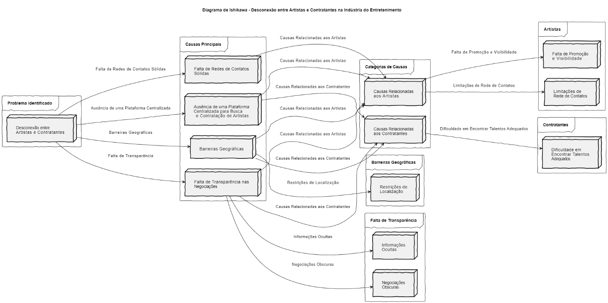
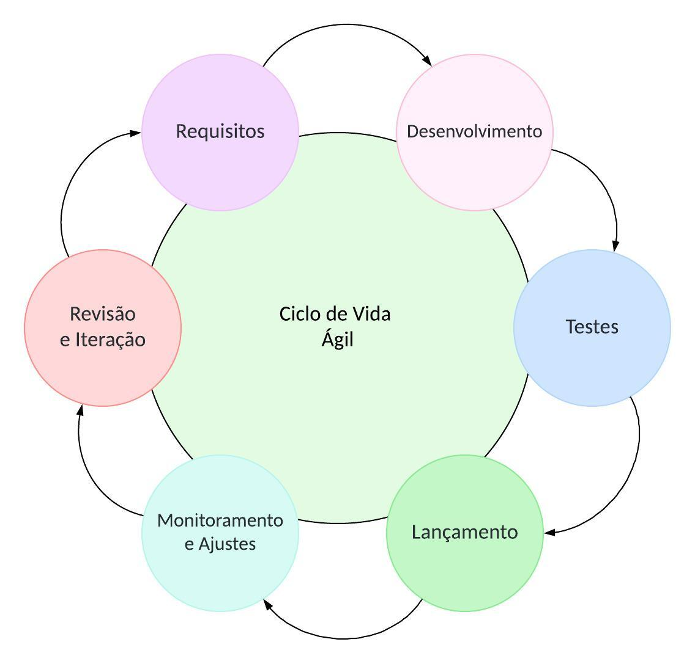
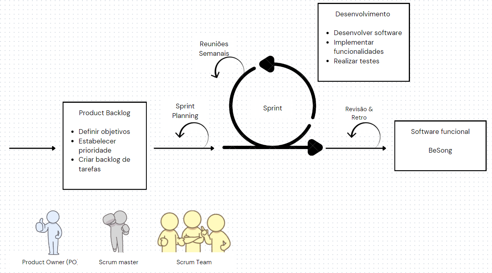

## **1. Visão geral do produto**
### **1.1 Problema**

No contexto da indústria do entretenimento, especificamente no nicho de shows ao vivo, existe
uma lacuna significativa na conectividade entre artistas/músicos e contratantes. Muitos músicos
talentosos lutam para encontrar oportunidades de shows, enquanto os proprietários de
estabelecimentos enfrentam dificuldades em descobrir uma variedade maior de talentos para
entretenimento ao vivo. Esta desconexão resulta em uma limitação na diversidade de
performances oferecidas nos estabelecimentos, bem como na perda de oportunidades para
músicos talentosos ganharem exposição e renda através de seus talentos.

    
<b>Figura 01:</b>Diagrama

    
<b>Fonte:</b>Autoria própria

Para enfrentar o desafio de conectividade entre músicos/bandas e proprietários de restaurantes e
bares, propomos o desenvolvimento do software BeSong. O BeSong é uma plataforma dedicada
à conexão eficiente e transparente entre músicos e contratantes, facilitando a descoberta,
contratação e agendamento de performances ao vivo. Os músicos podem criar perfis detalhados
destacando suas habilidades, enquanto os proprietários de estabelecimentos têm acesso a uma
variedade de talentos e ferramentas para comunicação e gerenciamento de shows. O BeSong
resolve o problema de conectividade, promove talentos e diversifica a oferta de entretenimento,
beneficiando tanto músicos quanto proprietários de restaurantes e bares.

### **1.2 Declaração de Posição do Produto**

Para enfrentar o desafio de conectividade entre músicos/bandas e proprietários de
Página 5 de 8
restaurantes e bares, propomos o desenvolvimento do software BeSong. O BeSong é uma
plataforma dedicada à conexão eficiente e transparente entre músicos e contratantes, facilitando
a descoberta, contratação e agendamento de performances ao vivo. Os músicos podem criar perfis
detalhados destacando suas habilidades, enquanto os proprietários de estabelecimentos têm
acesso a uma variedade de talentos e ferramentas para comunicação e gerenciamento de shows.
O BeSong resolve o problema de conectividade, promove talentos e diversifica a oferta de
entretenimento, beneficiando tanto músicos quanto proprietários de restaurantes, bares ou pessoas que desejam contratar os serviços.

    
<b>Tabela 01</b>

| **Para:** | Músicos e Contratantes|
| - | :- |
| **Necessidade:**| Encontrar oportunidades de shows ao vivo em restaurantes e bares, bem como descobrir uma variedade maior de talentos para entretenimento ao vivo.|
| **O BeSong:** | É uma Plataforma web online. |
| **Que:** | Facilita a conexão entre músicos talentosos e proprietários de estabelecimentos, proporcionando uma ampla gama de oportunidades de shows e uma variedade diversificada de talentos para entretenimento ao vivo. |
| **Ao contrário:** | A principal alternativa competitiva é depender de redes de contatos pessoais ou de plataformas de contratação tradicionais. Sem o "BeSong", músicos e contratantes podem continuar a enfrentar dificuldades na descoberta e contratação de talentos, resultando em limitações na diversidade de performances oferecidas e oportunidades perdidas para ambos. |
| **Nosso produto:** | Diferencia-se ao oferecer uma plataforma centralizada e fácil de usar, que aborda diretamente os problemas de conectividade entre músicos e contratantes na indústria do entretenimento ao vivo. O "BeSong" prioriza a transparência, a acessibilidade e a variedade, proporcionando uma solução abrangente e eficaz para todas as partes envolvidas. | 

    
<b>Fonte:</b>Autoria própria

### **1.3 Objetivos do Produto**

O objetivo principal do projeto BeSong é desenvolver uma plataforma online que facilite
a conexão entre músicos/bandas e proprietários de restaurantes e bares, permitindo a contratação
de shows ao vivo de forma eficiente e transparente.
Objetivos Secundários:

1. Criar perfis detalhados para músicos/bandas, destacando suas habilidades, gêneros
musicais e amostras de trabalho.

2. Desenvolver uma interface intuitiva para proprietários de estabelecimentos explorarem
os perfis dos músicos/bandas e realizarem contratações.

3. Implementar ferramentas de comunicação, negociação, agendamento de shows e
gerenciamento de pagamentos na plataforma.

4. Promover talentos musicais emergentes, oferecendo-lhes uma plataforma para ganhar
visibilidade e oportunidades de shows.

O objetivo principal do projeto BeSong é desenvolver uma solução tecnológica inovadora
para resolver o problema de conectividade entre músicos/bandas e proprietários de restaurantes e
bares. A plataforma será projetada para atender às necessidades específicas de ambos os grupos,
proporcionando uma experiência integrada que simplifica todo o processo de contratação de
shows ao vivo. Com os objetivos secundários, visamos não apenas resolver o problema
identificado, mas também promover talentos musicais emergentes, diversificar a oferta de
entretenimento nos estabelecimentos e criar oportunidades para o crescimento e desenvolvimento
da indústria musical local.

### **1.4 Tecnologias a Serem Utilizadas**

O projeto BeSong contará com a utilização das tecnologias de **HTML**(HyperText Markup
Language), para criar e estruturar uma página web, e definir elementos básicos. **CSS**(Cascading
Style Sheets), para estilizar e dar uma melhor aparência visual para os elementos do HTML, fazendo
com que a página se torne mais atrativa, garantindo melhor experiência para o usuário. **JavaScript**,
para adicionar interatividade e dinamismo, concluindo assim o Frontend que será utilizado no
projeto. Será utilizado também **Node.js**, que permitirá que os desenvolvedores consigam usar o
JavaScript para fazer o Backend da aplicação web, além disso, o Node.js irá interagir com o **MySQL**
que será utilizado para fazer a gerência do banco de dados do projeto.

## **2. Visão geral do projeto**

### **2.1 Ciclo de vida do projeto de desenvolvimento de software** 

    
<b>Figura 02:</b>Ciclo de vida do projeto

    
<b>Fonte:</b>Autoria própria

Um ciclo de vida ágil pode ser dividido em seis fases, que se repetem em um loop contínuo de desenvolvimento e melhoria contínua. Aqui estão as fases: 

**Fase 1:** Definição do Requisito 

Identificar os requisitos do software, incluindo as características e funcionalidades necessárias para a exposição e contratação de músicos. 

Definir os objetivos do software e as métricas de sucesso. 

Estabelecer a prioridade dos requisitos e criar um backlog de tarefas. 

**Fase 2:** Desenvolvimento 

Desenvolver o software, seguindo as diretrizes de design e arquitetura estabelecidas. 

Implementar as funcionalidades e características definidas no backlog de tarefas. 

Realizar testes unitários e integração para garantir a qualidade do software. 

**Fase 3:** Testes 

Realizar testes de aceitação para verificar se o software atende aos requisitos e objetivos definidos. 

Realizar testes de usabilidade para garantir que o software seja fácil de usar e intuitivo. 

Realizar testes de performance para verificar a escalabilidade e estabilidade do software. 

**Fase 4:** Lançamento 

Lançar o software para um grupo de usuários selecionados (beta testing). 

Coletar feedback dos usuários e realizar ajustes necessários. 

Realizar testes de produção para garantir que o software esteja pronto para uso em produção. 

**Fase 5:** Monitoramento e Ajuste 

Monitorar o desempenho do software em produção, coletando dados sobre a utilização e feedback dos usuários. 

Realizar ajustes e melhorias contínuas, baseados nos dados coletados e feedback recebido. 

Realizar revisões e ajustes no backlog de tarefas para priorizar as funcionalidades e melhorias. 

**Fase 6:** Revisão e Iteração 

Revisar o ciclo de vida do software, avaliando o sucesso e os desafios enfrentados. 

Realizar ajustes e melhorias contínuas, baseados nos resultados e feedback recebido. 

Iterar o ciclo de vida, refinando o processo e melhorando a qualidade do software. 

Essas fases devem ser repetidas em um loop contínuo, permitindo que o software seja desenvolvido, testado, lançado e melhorado continuamente, de acordo com as necessidades dos usuários e do mercado. 

### **2.2 Organização do Projeto**

    
<b>Tabela 02:</b>Papéis e Atribuições

| Papel | Atribuiçõe | Responsável|
|-------|------------|------------|
| Product Owner | O Product Owner é o responsável por garantir que o produto atenda às necessidades dos usuários e do negócio, atualizar o escopo do produto, organizar o escopo das sprints, validar as entregas, trabalhando em estreita colaboração com a equipe de desenvolvimento e os stakeholders. | Felipe Veríssimo |
| Front-End Developer | Os desenvolvedores front-end são responsáveis por criar a interface do usuário (UI) de um aplicativo ou site, focando na experiência do usuário.| Felipe Veríssimo, Davi Casseb, Fernanda Noronha, Yuri Guimarães |
| Back-End Developer | Os desenvolvedores back-end são responsáveis por criar a lógica de negócios e a infraestrutura de um aplicativo ou site, focando na parte "por trás das cenas". | Victor Andreozzi, Brenno Oliveira, Henrique Alencar, Paola Lima |
| Scrum Master | O Scrum Master é responsável por garantir que a equipe esteja trabalhando de acordo com os princípios do Scrum e que os processos sejam eficientes e eficazes. | Davi Casseb |

    
<b>Fonte:</b>Autoria própria

Apresentada a divisão de atribuições e responsabilidades entre os membros do projeto, sem qualquer relação de hierarquia ou grau de importância. Todos os integrantes são igualmente importantes e responsáveis pelo sucesso do projeto. 

### **2.3 Planejamento das Fases e/ou Iterações do Projeto**

    
<b>Tabela 03:</b>Fases do Projeto

| Sprint | Produto (Entrega) | Data Início | Data Fim | Entregável(eis) | Responsáveis | % conclusão |
|--------|-------------------|-------------|----------|-----------------|--------------|-------------|
| Sprint 1 | Definição do Produto | 29/04/2024 | 03/05/2024 | (*) | Todos os integrantes do grupo | Intervalos mínimos de 10 em 10 % |
| Sprint 2 | Documento de Visão e Documento de Arquitetura. | 06/05/2024 | 10/05/2024 | Documento de visão e documento de arquitetura | Todos os integrantes do grupo | 10% |
| Sprint 3 | Criar perfil de contratante e de músico | 13/05/2024  | 17/05/2024 | Design do projeto e criação de perfil de contratante e de músico | Todos os integrantes do grupo | 20% |
| Sprint 4 | Editar informações do perfil | 20/05/2024 | 25/05/2024 | Disponibilizar opção de editar informações dos perfis | Todos os integrantes do grupo | 15% |
| Sprint 5 | Criar visualização do catálogo de artistas | 03/06/2024 | 07/06/2024 | Disponibilizar visualização do catálogo do artista   | Todos os integrantes do grupo | 15% |
| Sprint 6 | Disponibilizar filtro dos músicos | 10/06/2024 | 14/06/2024 | Entregar possibilidade de filtro dos músicos. | Todos os integrantes do grupo | 20% |
| Sprint 7 | Contatar o músico | 17/06/2024 | 21/06/2024 | Disponibilizar funcionalidade de contato             | Todos os integrantes do grupo | 20% |

    
<b>Fonte:</b>Autoria própria

### **2.4 Matriz de Comunicação** 

A equipe se encontrará diariamente, fazendo reuniões curtas e com o objetivo de acompanhar o desenvolvimento e o progresso do projeto, e além disso ajustar o plano. Será feito também Sprints semanais com o objetivo de planejar as atividades a serem feitas durante a semana e também entregar atividades planejadas anteriormente. 

    
<b>Tabela 04:</b>Matriz de Comunicação

| Descrição | Área/ Envolvidos | Periodicidade | Produtos Gerados |
|-----------|------------------|---------------|------------------|
| Sprint planning, Sprint Review, Sprint Retrospective | Equipe do Projeto/ monitor | Semanal | Atividades a serem realizadas |
|Sprint de uma semana para garantir entregas | Equipe do Projeto | Semanal | Entrega de funcionalidade |
| Comunicar situação do projeto | Equipe do projeto | Diário | Identificar problemas |

    
<b>Fonte:</b>Autoria própria

### **2.5 Gerenciamento de Riscos** 

O plano de gerenciamento de riscos tem como objetivo identificar, analisar e planejar ações para lidar com possíveis riscos relacionados ao desenvolvimento do projeto. Com base em análises, serão implementadas medidas preventivas, de mitigação, eliminação ou aceitação dos riscos identificados. 

Para medir o impacto que os riscos podem causar para o projeto será utilizado uma pequena tabela na qual classifica o grau de exposição, que será o grau de impacto e probabilidade de cada risco acontecer. 

    
<b>Tabela 05:</b>Grau de Exposição

| Grau de Exposição | Descrição |
|-------------------|-----------|
| Muito baixo       | Impacto pouco expressivo no desenvolvimento do projeto. |
| Baixo             | Pouco impacto no desenvolvimento do projeto.          |
| Médio             | Possui certo impacto, porém é facilmente recuperado.  |
| Alto              | Há grande impacto no desenvolvimento do projeto.      |
| Muito alto        | O impacto inviabiliza o projeto.                      |

    
<b>Fonte:</b>Autoria própria

Durante o desenvolvimento de um projeto de software, é crucial acompanhar e monitorar os riscos envolvidos, uma vez que eles não são estáticos e podem variar em termos de gravidade ao longo do projeto. Para organizar o gerenciamento de riscos de forma clara e acessível foi contruído uma tabela que fornece uma visão clara e organizada dos riscos identificados, na qual permite que a equipe monitore ao decorrer do desenvolvimento do projeto. 

    
<b>Tabela 06:</b>Gerenciamento de Riscos

| Risco | Grau de Exposição | Medidas de Mitigação | Plano de Contingência |
|-------|-------------------|----------------------|-----------------------|
| Falta de conhecimento com as tecnologias de desenvolvimento. | Muito alto | Escolher os alunos que estão dispostos a aprender as ferramentas necessárias. | Procurar cursos e aplicar treinamento sobre as tecnologias. |
| Falta de comunicação entre os integrantes do grupo. | Alto | Estabelecer ferramentas de comunicação, realizações de reuniões e assuntos pontuais por WhatsApp.| Sempre deixar principais pontos das sprints em ambientes que os integrantes acessam constantemente. |
| Desistência de algum membro da equipe.| Alto | Dividir de forma igualitária as issues do projeto. | Adequar os horários e realocar as tarefas entre os membros sem sobrecarregar nenhum membro. |
| Baixa produtividade dos integrantes do grupo.| Médio | Motivação da equipe através de reuniões. | Realizar checkpoints de saúde mental com os integrantes do grupo, ou elaboração de gamificação. |
| Alteração do escopo. | Médio | Reuniões para descrever de forma clara os requisitos do projeto. | Realizar a revisão e atualização do planejamento. |
| Conflito entre entregas da sprint e de tarefas de outras disciplinas. | Muito alto | Planejamento das entregas. | Redefinição do planejamento das tarefas. |

    
<b>Fonte:</b>Autoria própria

### **2.6 Critérios de Replanejamento** 

Os critérios de replanejamento ajudarão a determinar quando e como deve ocorrer o replanejamento do projeto, garantindo que a equipe esteja preparada para lidar com os riscos conforme eles surgirem. Os critérios de replanejamento serão alinhados aos riscos identificados e suas respectivas ações de mitigação e planos de contingência. 

**Falta de conhecimento com as tecnologias de desenvolvimento** 

Critério: Se a falta de habilidade técnica em tecnologias essenciais persistir após as primeiras fases de aprendizado e impactar as entregas do projeto. 

Ação de Replanejamento: Intensificar o treinamento com cursos, vídeos aulas, apostilas e aumentar a supervisão técnica. Revisar o cronograma para alocar tempo adicional para treinamento e aprendizado. 

**Falta de comunicação entre os integrantes do grupo**

Critério: Se problemas de comunicação resultarem em erros repetidos ou falta de compromisso com as entregas em mais de duas sprints consecutivas. 

Ação de Replanejamento: Revisar e possivelmente mudar as ferramentas de comunicação e os processos de gerenciamento de tarefas para garantir clareza. Implementar check-ins adicionais com os membros da equipe. 

**Desistência de algum membro da equipe** 

Critério: Se a saída de um membro da equipe resultar em atrasos significativos ou sobrecarga de trabalho para os demais membros. 

Ação de Replanejamento: Reavaliar e redistribuir as tarefas sem sobrecarregar os membros restantes. Considerar ajustes no escopo do projeto para atender ao novo contexto de equipe. 

**Baixa produtividade dos integrantes do grupo** 

Critério: Se a produtividade não atingir 75% das metas estabelecidas por mais de uma sprint. 

Ação de Replanejamento: Implementar sessões regulares de saúde mental e revisar a estrutura de gamificação para aumentar o engajamento. Revisão do cronograma do projeto para acomodar a produtividade atual. 

**Alteração do escopo** 

Critério: Se alterações no escopo forem solicitadas e aumentarem o trabalho e a dificuldade significativamente em relação ao planejado inicialmente. 

Ação de Replanejamento: Realizar reuniões com todos da equipe para realinhar expectativas e ajustar o planejamento do projeto, incluindo orçamento e prazos. 

**Conflito entre entregas da sprint e de tarefas de outras disciplinas**

Critério: Se os conflitos de agenda impactarem a conclusão das sprints em duas ou mais ocasiões consecutivas. 

Ação de Replanejamento: Redefinir o planejamento das tarefas considerando os compromissos acadêmicos dos membros da equipe, priorizando entregas críticas e ajustando o cronograma de sprints. 

Os critérios e ações de replanejamento ajudarão a manter o projeto alinhado com seus objetivos, e caso necessário adaptando-se a desafios e mudanças que podem surgir durante o desenvolvimento. Para que haja uma implementação eficaz do processo de replanejamento deve haver um monitoramento contínuo, pontos de controle para revisões do projeto e uma comunicação efetiva apontando o andamento do projeto. 

## **3 Processo de Desenvolvimento do Software**

Nesta seção, registramos a decisão da equipe em adotar o SCRUM como metodologia de desenvolvimento de software. Essa escolha se baseia na capacidade do SCRUM em promover uma entrega contínua de valor ao cliente, sua estrutura iterativa e colaborativa, bem como sua ênfase na adaptação a mudanças. 

Os elementos do SCRUM que serão adotados pela equipe foram selecionados com base nas fases identificadas no ciclo de vida ágil descrito na seção 2.1, visando atender aos requisitos do projeto e garantir uma abordagem eficaz para o desenvolvimento de software. São eles: 

**Sprints:** O desenvolvimento será dividido em sprints de uma semana, para garantir entregas frequentes e feedback contínuo. 

**Reuniões semanais:** Serão realizadas ao longo da semana (de uma a três reuniões) para acompanhar o progresso, identificar obstáculos e ajustar o plano conforme necessário. 

**Product Backlog:** Um backlog de produtos será mantido e priorizado com base nas necessidades do cliente e nas estimativas de esforço da equipe. 

**Sprint Planning:** No início de cada sprint, será realizada uma reunião de planejamento para selecionar as atividades a serem realizadas durante o sprint. 

    
<b>figura 03:</b>Diagrama ilustrativo do fluxo de trabalho no processo de desenvolvimento de software com SCRUM.

    
<b>Fonte:</b>Autoria própria

A **Figura 3** apresenta o diagrama ilustrativo do fluxo de trabalho a ser seguido pela equipe durante o processo de desenvolvimento de software utilizando o SCRUM. Este diagrama representa as atividades principais, os artefatos envolvidos e as responsabilidades atribuídas aos membros da equipe. 

## **4 Declaração de Escopo do Projeto** 

### **4.1 Backlog do produto** 

O backlog de requisitos deste projeto foi cuidadosamente desenvolvido com base na compreensão das necessidades dos nossos clientes - um músico em busca de oportunidades para mostrar seu talento e um contratante procurando talentos para eventos e projetos. Ao entender profundamente as perspectivas e objetivos desses dois grupos de usuários, pudemos definir requisitos que atendem às suas expectativas e facilitam suas interações com a plataforma. 

A partir dessas necessidades identificadas, foram elicitados requisitos a partir de entrevista com representantes dos dois grupos e um brainstorm da equipe. Dessa forma, as definições devem abranger a criação e edição de perfis, a visualização do catálogo de serviços e a implementação de uma barra de pesquisa com filtro. Esses requisitos são fundamentais para garantir uma experiência fluida e eficiente para os usuários, permitindo que eles encontrem facilmente o que estão procurando e alcancem seus objetivos de maneira eficaz. 

### **4.2 Perfis**

    
<b>Tabela 07:</b>Perfis de acesso

| Nome do perfil  | Características do perfil | Permissões de acesso |
|-----------------|---------------------------|----------------------|
| Administrador   | Responsável pelo gerenciamento de usuários e categorias presentes no sistema. | - Acesso total ao sistema para gerenciar usuários e conteúdos; - Monitorar atividades e garantir a segurança e integridade dos dados. |
| Músico| Músicos que buscam divulgar sua carreira artística a fim de serem contratados para shows.| - Se cadastrar e gerenciar seu próprio perfil; - Adicionar informações; - Mostrar o seu trabalho como músico; - Definir preferências de contato e de disponibilidade. |
| Contratante | Donos de bares, restaurantes ou organizadores de eventos que buscam contratar músicos. | - Visualizar o catálogo de músicos disponíveis; - Pesquisar músicos de acordo com suas preferências; - Visualizar todas as informações do músico escolhido; - Entrar em contato com o músico escolhido. |

    
<b>Fonte:</b>Autoria própria

### **4.3 Cenários**

    
<b>Tabela 08:</b>Cenários Funcionais

| Numeração do cenário | Nome do cenário                      | Sprints |
|----------------------|---------------------------------------|---------|
| 01                   | Documentos de projeto                 | 1       |
| 02                   | Modelagem                             | 2       |
| 03                   | Cadastro de músico                    | 3       |
| 03                   | Cadastro contratante                  | 3       |
| 04                   | Editar informações do perfil          | 4       |
| 05                   | Criar visualização do catálogo de artistas | 5  |
| 06                   | Disponibilizar filtro dos músicos     | 6       |
| 07                   | Contatar o músico                     | 7       |

    
<b>Fonte:</b>Autoria própria

### **4.4 Tabela de Backlog do produto**

    
<b>Tabela 09:</b>Backlog

| Numeração (Cenário / requisito) | Sprint | Nome do requisito | Tipo de requisito | Priorização do requisito  | Descrição sucinta do requisito | User stories (U.S.) associadas |
|------|--------|--------|---------|----------|-----------|------------|
| 1 | 1 | Definir template | Requisito não funcional | Muito alta | Deve ser definido a arte padrão do template que servirá de base em toda aplicação | Eu como usuário do software gostaria de um template padrão e definido em todo o site |
| 2 | 2 | Modelar banco de dados | Requisito não funcional | Alta | Deve ser projetada a estrutura do banco de dados para armazenar informações sobre artistas, contratantes, perfis de usuário, catálogo de serviços, etc | Como usuário gostaria de visualizar o perfil salvo e criado pelos artistas |
| 3 | 3 | Criar perfil de artista | Requisito funcional | Muito alta | Implementação de uma funcionalidade que permita aos artistas criar perfis pessoais, incluindo informações como biografia, portfólio, fotos e vídeos de trabalhos anteriores, categoria musical | Como um artista, quero poder criar um perfil pessoal no site, para que eu possa mostrar meu portfólio, compartilhar informações sobre minha experiência e habilidades, e me conectar com potenciais contratantes |
| 3 | 3 | Criar perfil de contratante | Requisito funcional | Médio | Permitir que os contratantes pesquisem e visualizem perfis de artistas de acordo com suas necessidades específicas  | Como um contratante quero poder criar um perfil no site, para que eu possa procurar por artistas com base na proposta do meu evento |
| 4 | 4 | Editar perfis de usuários | Requisito funcional | Alta | Implementar uma interface de usuário que permita aos usuários editar e atualizar suas informações | Como um usuário registrado, quero poder editar meu perfil a qualquer momento, para que eu possa manter minhas informações atualizadas, como mudança de endereço, novas fotos ou atualização de descrição |
| 5 | 5 | Criar visualização do catálogo de artistas | Requisito funcional | Muito alta | Desenvolver uma funcionalidade que permita aos usuários visualizar e explorar um catálogo de artistas e serviços oferecidos, facilitando a descoberta e a seleção de recursos relevantes | Como um visitante do site, quero poder navegar pelo catálogo de artistas e serviços oferecidos, para que eu possa encontrar os artistas disponíveis para contratação com base em suas áreas de atuação, preços e avaliações |
| 6 | 6 | Criar barra de pesquisa | Requisito funcional | Médio | Implementar uma barra de pesquisa que permita aos usuários realizar consultas textuais em todo o sistema, fornecendo resultados relevantes e filtráveis de forma rápida e eficiente | Como um usuário do site, quero poder usar uma barra de pesquisa para encontrar artistas e serviços específicos, digitando palavras-chave relacionadas, para que eu possa encontrar rapidamente o que estou procurando sem precisar navegar por todo o catálogo |
| 6 | 6 | Criar filtro para pesquisa | Requisito funcional | Baixa | Adicionar opções de filtro à funcionalidade de pesquisa para permitir que os usuários refinem os resultados de acordo com suas preferências | Como um usuário do site, quero poder refinar os resultados da minha pesquisa usando filtros, como categoria de serviço, localização e gênero, para que eu possa encontrar artistas que atendam às minhas necessidades específicas com mais facilidade |
| 6 | 6 | Categorizar | Requisito funcional | Alta | Classificar os músicos a partir de categorias de estilos musicais de tal forma que possibilite a pesquisa por categoria | Como contratante, quero poder pesquisar o músico a partir do meu estilo musical de preferência |
| 7 | 7 | Contatar o músico | Requisito funcional | Alta | Adicionar forma de contato entre o contratante e o músico para estabelecer essa comunicação | Como contratante, quero poder entrar em contato com o músico a partir da plataforma, pois assim facilitará a minha comunicação com ele |

    
<b>Fonte:</b>Autoria própria

## **5 Referências Bibliográficas** 

SCHWABER, Ken; SUTHERLAND, Jeff. Guia do Scrum: Um guia definitivo para o Scrum: As regras do jogo. Tradução de Rafael Sabbagh, [S.l.], 2016. Disponível em: http://www.scrumguides.org/docs/scrumguide/v2016/2016-Scrum-Guide-Portuguese-Brazilian.pdf. Acesso em: 01 maio 2024. 

SABBAGH, Rafael. Scrum: Gestão ágil para projetos de sucesso. São Paulo: Casa do Código, 2016. 

Manifesto para Desenvolvimento Ágil de Software. [S.l.: s.n.], 2001. Disponível em: http://www.manifestoagil.com.br/. Acesso em: 01 maio 2024. 

| Versão | Data | Descrição da Alteração | Nome(s) Integrante(s) |
| :----: | :--: | :--------------------: | :-------------------: |
| 1.0 | 01/05/2024 | Escrita do documento de visão | Brenno, Davi, Felipe, Fernanda, Henrique, Paola, Victor, Yuri |
| 1.1 | 02/06/2024 | Corrigindo datas da tabela 03 | Brenno da Silva|