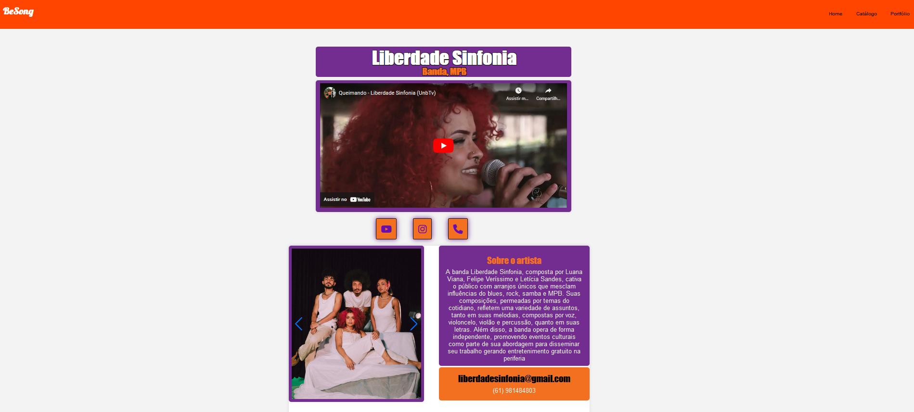
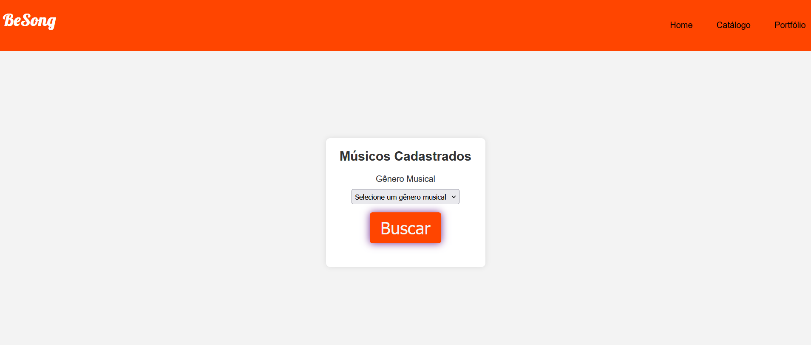

## **Projeto BeSong**
### **1. Visão Geral do Projeto** 

O projeto BeSong visa desenvolver uma plataforma web online que conecta artistas do ramo da música com proprietários de restaurantes, bares, casas de shows ou particulares, facilitando a contratação de performances ao vivo. A ideia surgiu da necessidade de solucionar a desconexão entre artistas talentosos que buscam oportunidades de shows e proprietários de estabelecimentos que desejam diversificar suas opções de entretenimento de shows ao vivo. 

### **2. Objetivos do Produto** 

1. Criar perfis detalhados para os artistas musicais, destacando suas habilidades, gêneros musicais e amostras de seus trabalhos. 

2. Desenvolver uma interface intuitiva para que pessoas e empresas explorem os perfis dos artistas e possam contratar performasses. 

3. Promover talentos musicais emergentes, oferecendo-lhes uma plataforma para ganhar visibilidade e oportunidades de contratos. 

### **3. Tecnologias Utilizadas** 

A plataforma será desenvolvida utilizando tecnologias como HTML, CSS e Javascript para o desenvolvimento do Front-end. Utilizará Node.js com apoio do Express no Back-end na qual irá interagir com o MySQL que será utilizado para fazer a gerência do banco de dados do projeto. Para integrar os dados do banco e o back-end foi utilizado o AWS, o que foi uma grande dificuldade de conhecimento tecnológico. 

### **4. Principais funcionalidades** 

#### **4.1. Cadastro de Usuários** 
Permitir que músicos e contratantes se registrem na plataforma, criando perfis detalhados.

    
<b>Figura 01:</b>Página de cadastro do musico/artista

    
<b>Fonte:</b>BeSong

    
<b>Figura 02:</b>Página de cadastro do Contratante

    
<b>Fonte:</b>BeSong

#### **4.2. Perfil do Artista** 
Perfil com informações sobre gêneros musicais, portfólio, links redirecionando para redes sociais e meios de contato. 

    
<b>Figura 03:</b>Página Portifólio do Artista

    
<b>Fonte:</b>BeSong

#### **4.3. Busca e Catálogo**
Fornecer catálogo de artistas cadastrados e a opção de busca que permite contratantes encontrar artistas com base em critérios específicos (gênero musical, região).

    
<b>Figura 04:</b>Página de Busca por Artistas

    
<b>Fonte:</b>BeSong

### **5. Impacto Esperado** 

Espera-se que a plataforma BeSong facilite o processo de contratação de músicos para shows ao vivo, proporcionando uma solução que beneficia tanto artistas quanto quem contratar seus serviços. A plataforma visa reduzir as dificuldades na descoberta de talentos, trazendo uma maior visibilidade, mais oportunidades de shows para os artistas, contratantes ter acesso a uma variedade de artistas assim promovendo uma diversidade de performances e eventos ao vivo. 

### **6. Conclusão** 

O BeSong é um projeto ambicioso que, ao abordar uma necessidade no mercado de entretenimento ao vivo, tem o potencial de facilitar a maneira como músicos e contratantes se conectam e colaboram. Com um planejamento, gestão de projeto e um compromisso com o desenvolvimento, o projeto poderá alcançar seus objetivos e contribuir com uma melhora para a comunidade da indústria dos artistas e contratantes. 

| Versão | Data | Descrição da Alteração | Nome(s) Integrante(s) |
| :----: | :--: | :--------------------: | :-------------------: |
| 1.0 | 15/06/2024 | Escrita do Sumário Executivo | Brenno da Silva |